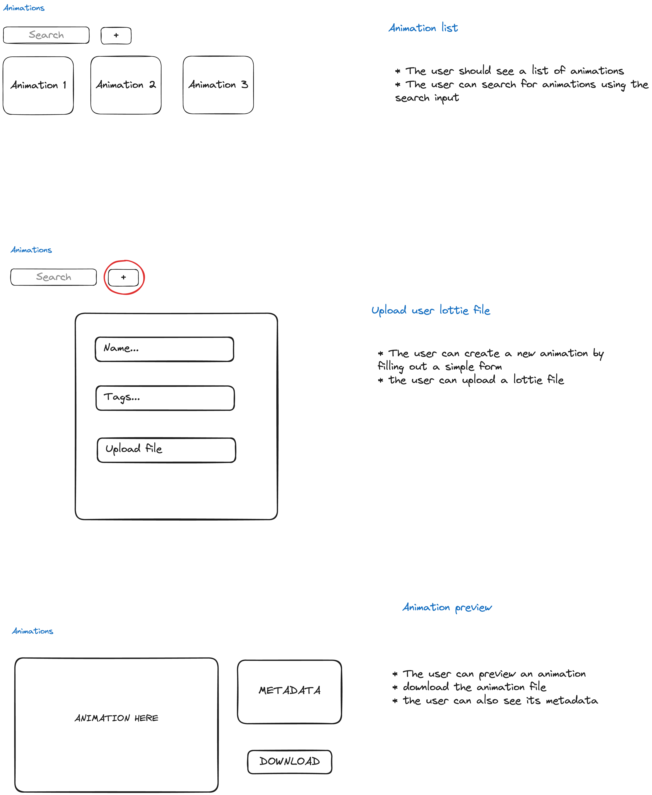
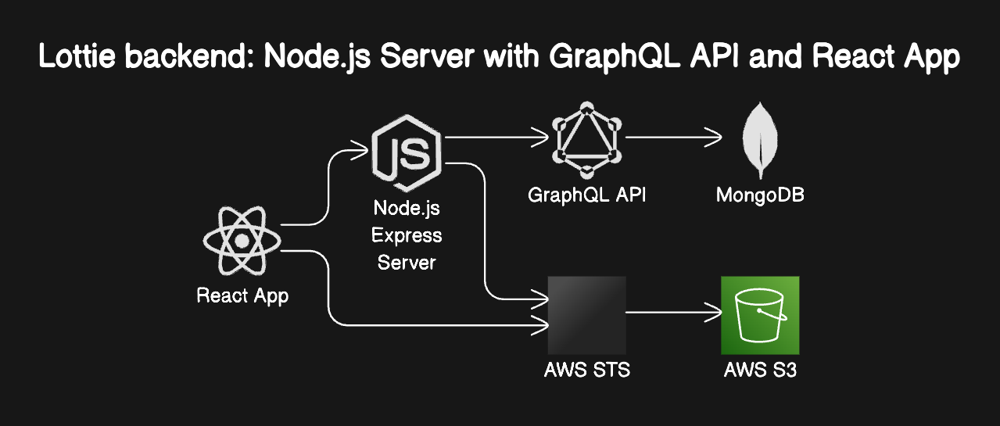

# Lottie: A small fullstack GraphQL React app

### Frontend stack:

- [react](https://www.npmjs.com/package/react):
  - JavaScript library for creating user interfaces
- [react-router-dom](https://www.npmjs.com/package/react-router-dom)
  - declarative routing
- [zod](https://www.npmjs.com/package/zod)
  - for schema validation
- [Zustand](https://docs.pmnd.rs/zustand/getting-started/introduction):
  - for managing our global store
- [Tailwind](https://ui.shadcn.com/docs/installation/manual)
  - utility css framework
- [shadcn](https://ui.shadcn.com/)
  - component library
- [dotlottie-react](https://www.npmjs.com/package/@lottiefiles/dotlottie-react)
  - A React library for rendering [**lottie**](https://lottiefiles.github.io/lottie-docs/) animations in the browser.
- [Apollo GraphQL](https://www.apollographql.com/):
  - state management library that manages both local and remote data with GraphQL
- aws-sdk:
  - `@aws-sdk/client-s3`
  - `@aws-sdk/s3-request-presigner`

Build Tool:

- [Vite](https://www.npmjs.com/package/vite): `npm create vite@latest resume-builder -- --template react-ts`
  - Our build tool for development and production
- [vite-plugin-pwa](https://vite-pwa-org.netlify.app/)
  - A progressive web application plugin for Vite

### Backend stack:

- [Nodejs](https://nodejs.org/en)
  - JavaScript runtime environment
- [Express](https://expressjs.com/)
  - A web framework node nodejs
- [MikroORM](https://mikro-orm.io/)
  - TypeScript ORM for Node.js based on Data Mapper, Unit of Work and Identity Map patterns.
- mongoDB
  - NoSQL cross-platform, document-oriented database
- [GraphQL](https://graphql.org/)
  - A query language for APIs
- express-graphql
- type-graphql
- aws-sdk/client-sts
- Docker
  - to spin a mongodb container with `docker-compose`

# Assignment:

- Requirements: [link](https://drive.google.com/file/d/1Uy8rjHuNHOl3kf-h6bgdS1QZJglKsBXy/view)
- A simple React App where we can search and preview Lottie Animations
- User can also download and upload Lottie Animations
- The application should also work offline even when no internet connection
- Lottie GraphQL API: [https://graphql.lottiefiles.com/graphiql](https://graphql.lottiefiles.com/graphiql)

# Implementation plan:

## Frontend Project Structure



For this POC we choose to have a decoupled approach with a `data layer` `domain layer` and a `view layer`.

- `data layer`: contains
  - **repositories**: mainly interfaces (API like interfaces). It hides the logic of whether we are using local storage, a cloud service…
  - **adapters**: the implementations of the repositories
  - **use cases**: retrieves data from the repositories and maps it with the view interfaces
- `domain layer`: contains all of our business logic interfaces. Our models. For example an interface `animations` might contain the following properties: name, tags, createdAt, src…

```
src/
├── shared/
│   ├── components/   # shadcn/ui components
│   └── ...           # other shared folders and files
└── app/
    └── animations/
        ├── data/     # data layer
        │   └── animations.reposiotry.ts
        │   └── animations.adapter.ts
        │   └── animations.usecase.ts
        ├── domain/   # domain layer
        │   └── animations-entity.ts
        └── view/     # view layer
            └── animations-list/
                └── add-new-animation/
                    └── index.tsx
                └── animation-preview/
                    └── index.tsx
                └── ...  # other view components and files

```

## Animation list and upload animation

- we add a new route `/aninmations`
- In our `domain layer` we need interfaces/types:

```tsx
export type AnimationType = {
  id: UUID | string;
  name: string;
  tags: string;
  src: string;
  createdAt: number;
  updatedAt: number;
  createdOffline?: boolean;
};

export type AnimationListType = Array<AnimationType>;
```

- we need a dialog modal with some `input text` components (name, tags and file upload) when adding a new animation.
- when user submits a new animation we will make two API calls:
  - One for uploading the Lottie file into a bucket (S3)
  - And another one to the GraphQL API
- Also we need to keep the data on client side so we need to sync it with Local storage and in our `data layer` we will be using a simple store that persists data in local storage using `zustand`
- for the `view layer` we are going to need a few components

```
animations/
├── data/
├── domain/
└── view/
    ├── animations-list/
        └── add-new-animation/
            └── index.tsx
        └── index.tsx
    ├── animation-preview/
        └── index.tsx
```

## Backend Project Structure



- For our GraphQL API we try to pick the best practices from clean architecture: single responsibility and inversion of control with dependency injection

  - `infrastructure`: related to server infrastructure such as database and ORM configuration, log system, web servers and libs related

  ```tsx
  infrastructure/
  ├── MikroORM/ # our ORM
  ├── container/ # a container that will instantiate our MikroORM and MongoDB entity manager
  ├── logger/ # our server logger system with winston
  ├── server/ # our express server and its middlewares
  ```

  - `application`: here resides our core business logic with our entities, repositories and our business models

  ```tsx
  application/
  ├── contracts/ # with `class-validator` we validate our API requests and reponses
  ├── errors/ # classes with right status and error message
  ├── models/ # our entities
  ├── repositories/ # our repositories and adapters with our entity manager
  ├── resolvers/ # our grapphql resolve
  ```

  Here is our model `Animation`

  ```tsx
  import { Entity, Property } from "@mikro-orm/mongodb";
  import { BaseEntity } from "@/application/models/baseEntity/BaseEntity";
  import { Field, ObjectType } from "type-graphql";
  import AnimationsValidator from "@/application/contracts/validators/animations/animations.validator";

  @ObjectType()
  @Entity()
  export class Animations extends BaseEntity {
    @Property()
    @Field()
    name: string;

    @Property()
    @Field()
    tags: string;

    @Property()
    @Field()
    src: string;

    constructor({ name, tags, src }: AnimationsValidator) {
      super();
      this.name = name;
      this.tags = tags;
      this.src = src;
    }
  }
  ```

  - Our `search` endpoint will perform a regex in the fields `name` and `tags` using the `$regex` operator from mongoDB

  ```tsx
    async findPaginated({
      first,
      after,
      name,
      tags,
    }: AnimationsRequest): Promise<PaginatedResponse<Animations>> {
      const query: FilterQuery<Animations> = after ? { _id: { $gt: new ObjectId(after) } } : {};
      const _$or: MongoQuery<Animations>[] = [];
      if (name) {
        _$or.push({ name: { $regex: name, $options: 'i' } });
      }
      if (tags) {
        _$or.push({ tags: { $regex: tags, $options: 'i' } });
      }

      if (_$or.length > 0) {
        query['$or'] = _$or;
      }

      const [items, totalCount] = await Promise.all([
        this.repository.find(query, {
          limit: first + 1,
          orderBy: { _id: 'ASC' },
        }),
        this.repository.count(),
      ]);

      const hasNextPage = items.length > first;
      if (hasNextPage) {
        items.pop();
      }
      return {
        items,
        hasNextPage,
        totalCount,
      };
    }

  ```

  - `config`: contains mainly our application configuration via environment variables
  - `utils`: contains some helpers

- We also leverage dependency injection in order to apply inversion of control with `tsrynge`
- We add most of our business logic into our entities by using reflection with `reflect-metada` and `type-graphql`
  - All requests, response and handlers (controllers) are handled by our resolvers
  - we also use `class-validator` in order to apply validations to our api responses
- For the purpose of this assignment we have also added an endpoint for the web client to retrieve AWS credentials so that the client can get and put objects in a S3 bucket.
  - Alternative solutions could be using Cognito Provider that allows guest session and with the right IAM role

### TODOs:

- Pagination is handled on the backend side but not in frontend side
- Add UI to let the user know wether the browser is online/offline
- The user can upload an animation file when offline

# Quickstart:

This is the minimum requirements in order to test this application locally

### Setup backend:

- You need a AWS IAM user
- An s3 bucket

```tsx
# enable CORS in your bucket
[
    {
        "AllowedHeaders": [
            "*"
        ],
        "AllowedMethods": [
            "POST",
            "GET",
            "DELETE",
            "PUT"
        ],
        "AllowedOrigins": [
            "http://localhost:3000",
            "https://localhost:4433"
        ],
        "ExposeHeaders": [
            "ETag"
        ],
        "MaxAgeSeconds": 3000
    }
]
```

- a role ARN with permissions to get and put objects in a S3 bucket.

```tsx
# your role policy
{
    "Version": "2012-10-17",
    "Statement": [
        {
            "Sid": "VisualEditor0",
            "Effect": "Allow",
            "Action": [
                "s3:PutObject",
                "s3:GetObject"
            ],
            "Resource": "arn:aws:s3:::{your-bucket-name}/*"
        }
    ]
}

# your role truested entities
{
    "Version": "2012-10-17",
    "Statement": [
        {
            "Effect": "Allow",
            "Principal": {
                "Service": "s3.amazonaws.com",
                "AWS": "{your-iam-user-arn}"
            },
            "Action": "sts:AssumeRole"
        }
    ]
}
```

- in `env.default` after you have created the above role you need the role ARN:

```tsx
AWS_S3_ROLE_ARN=arn:aws:iam::{account-id}:role/{role-name}
```

- Once you have added your role arn to `env.default` you can run the following:
  - `npm i`
  - `npm run db:start` # you can see the logs of your mongoDB container
  - in another terminal: `npm run dev`

Setup frontend

- In the `public/env.json` you need to add the name of your previously created S3 bucket and the AWS region. For example:

```tsx
{
	...
	"region": "us-west-1",
  "s3bucket": "lottie-animation-bucket"
}
```

- `npm i`
- in order to make the PWA work you need to run your web client with `https` . For this you need to install globally [`https-localhost`](https://www.npmjs.com/package/https-localhost)
- Once you have installed it you can run the following commands:
  - `npm run build`
  - `npm run serve`
- open your browser to `https://localhost:4433`

Demo

- [video](https://drive.google.com/file/d/1RuIXyvU3GahPTp9MNIsDCeBIEaHlTi0L/view?usp=sharing)
